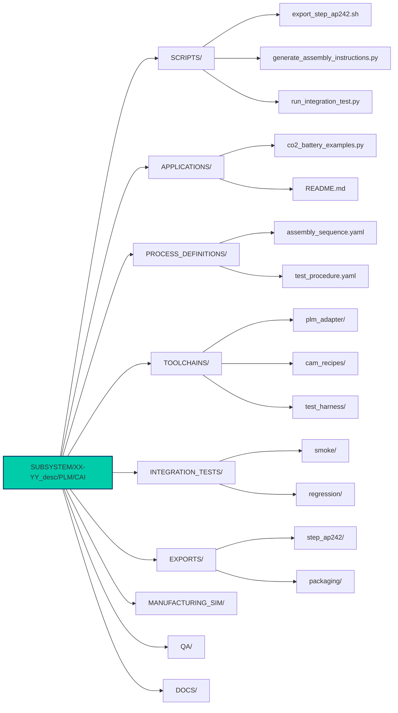

# CAI Directory Structure

*Computer-Aided Integration directory for subsystem `100-00_TEMPLATES_SSoT_QMS`*

## Summary (textual map)
- `SUBSYSTEM/XX-YY_desc/PLM/CAI/`
  - `README.md`, `META.json`
  - `SCRIPTS/`  
    - `export_step_ap242.sh`, `generate_assembly_instructions.py`, `run_integration_test.py`
  - `APPLICATIONS/`  
    - `co2_battery_examples.py`, `README.md`
  - `PROCESS_DEFINITIONS/`  
    - `assembly_sequence.yaml`, `test_procedure.yaml`
  - `TOOLCHAINS/`  
    - `plm_adapter/`, `cam_recipes/`, `test_harness/`
  - `INTEGRATION_TESTS/`  
    - `smoke/`, `regression/`
  - `EXPORTS/`  
    - `step_ap242/`, `packaging/`
  - `MANUFACTURING_SIM/`
  - `QA/`
  - `DOCS/`  
    - `CAI_GUIDE.md`, `INTERFACES.md`

## Visual Directory Structure



## Alt text / accessibility
Diagram showing `SUBSYSTEM/XX-YY_desc/PLM/CAI` at center with spokes to the folders above. Each spoke ends in a labeled node (SCRIPTS, APPLICATIONS, PROCESS_DEFINITIONS, TOOLCHAINS, INTEGRATION_TESTS, EXPORTS, MANUFACTURING_SIM, QA, DOCS). SCRIPTS lists three example files; PROCESS_DEFINITIONS lists two YAMLs; APPLICATIONS lists `co2_battery_examples.py`.

## Purpose

This directory contains Computer-Aided Integration (CAI) artifacts for the 100-00_TEMPLATES_SSoT_QMS subsystem. It provides a standardized structure for integration workflows, automation scripts, process definitions, and documentation.

## Quick Start

### Run Example Applications
```bash
python APPLICATIONS/co2_battery_examples.py
```

### Execute Integration Tests
```bash
python SCRIPTS/run_integration_test.py --test-type smoke
```

### Generate Assembly Instructions
```bash
python SCRIPTS/generate_assembly_instructions.py \
  PROCESS_DEFINITIONS/assembly_sequence.yaml \
  --output-dir ./output
```

### Export CAD to STEP AP242
```bash
./SCRIPTS/export_step_ap242.sh input_model.cad output_model.step
```

## Directory Descriptions

### SCRIPTS/
Automation scripts for CAD export, assembly instruction generation, and integration testing.

### APPLICATIONS/
Application-specific integration examples and use cases (e.g., CO2 battery integration).

### PROCESS_DEFINITIONS/
Formal assembly sequences and test procedures defined in YAML format.

### TOOLCHAINS/
Integration toolchain components including PLM adapters, CAM recipes, and test harnesses.

### INTEGRATION_TESTS/
Test suites divided into smoke tests (quick validation) and regression tests (comprehensive).

### EXPORTS/
Export formats (STEP AP242) and packaging artifacts for distribution.

### MANUFACTURING_SIM/
Manufacturing process simulations and validation artifacts.

### QA/
Quality assurance documentation, checklists, and acceptance criteria.

### DOCS/
Comprehensive documentation including `CAI_GUIDE.md` and `INTERFACES.md`.

## File Organization

- Use clear, descriptive filenames
- Include revision/version in filename
- Maintain neutral formats alongside native files
- Document file relationships in parent README

## Naming Convention

```
{PART_ID}_{DESCRIPTION}_{REV}.{ext}
```

Example: `GSE-07-10-001_Handling_Crane_R001.step`

## Standards

- Follow applicable CAx standards for this discipline
- Ensure traceability to EBOM items
- Maintain configuration control
- Comply with ISO 10303 (STEP), LOTAR, and ATA iSpec 2200

## Documentation

For detailed information, see:
- **[CAI Guide](DOCS/CAI_GUIDE.md)** - Comprehensive usage guide
- **[Interface Specifications](DOCS/INTERFACES.md)** - Interface control documentation
- **[META.json](META.json)** - Machine-readable directory metadata

---

**Last Updated:** 2025-10-23  
**Template Version:** 1.0.0  
**Maintainer:** CAI Integration Team
